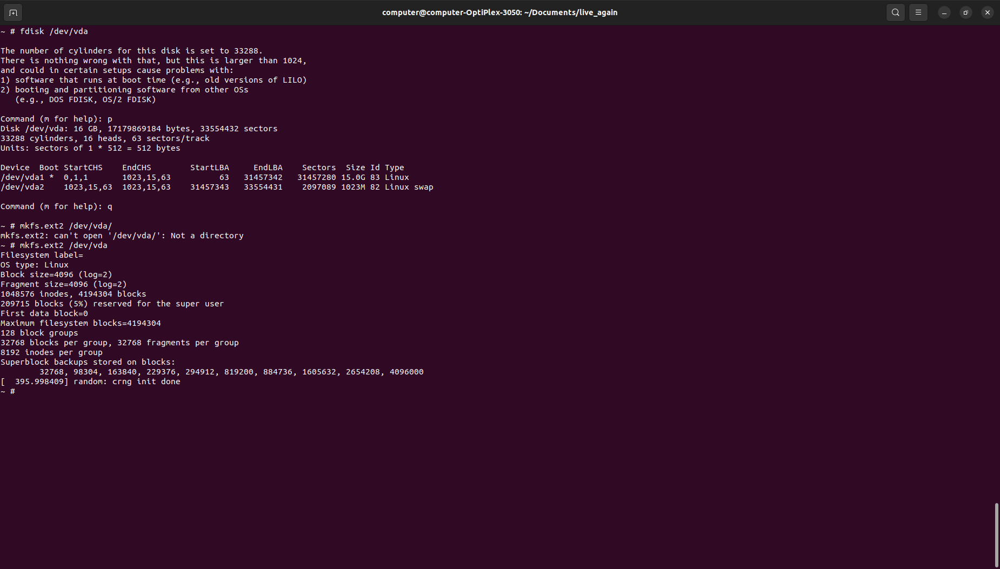
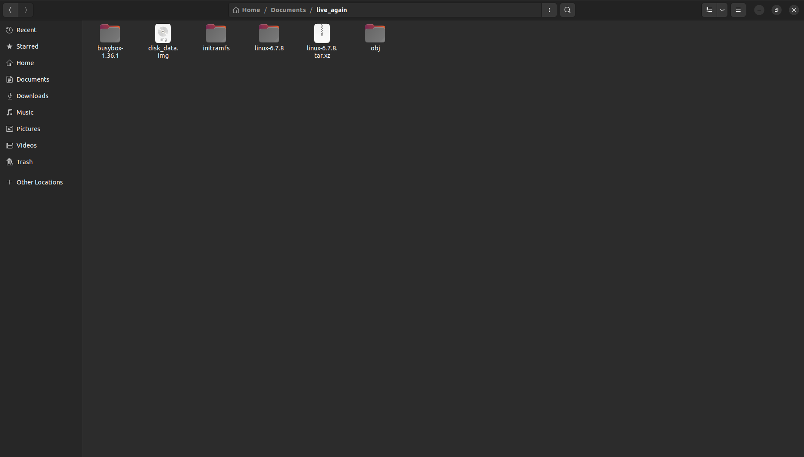

# Kernel Hacking

Roopam Taneja

IIT Roorkee CSE

## Some gyaan I had jotted down

- **libvirt**: It's an open-source API, daemon, and management tool for managing 
platform virtualization. It provides a toolkit to manage virtualization platforms. It supports various virtualization technologies such as KVM, QEMU etc.

- **QEMU CPU emulator**: QEMU is a free and open-source emulator that emulates a computer's processor through dynamic binary translation and provides a set of different hardware and device models for the machine, enabling it to run a variety of guest operating systems. It can run operating systems and programs made for one machine on a different machine 

- **KVM virtual machine**: Kernel-based Virtual Machine (KVM) is a full virtualization solution for Linux on x86 hardware containing virtualization extensions (Intel VT or AMD-V). KVM lets you turn Linux into a hypervisor that allows a host machine to run multiple, isolated virtual environments called guests or virtual machines (VMs).

- **virt-manager**: The virt-manager application is a desktop user interface for managing virtual machines through libvirt. It primarily targets KVM VMs, but also manages Xen and LXC (linux containers). It presents a summary view of running domains, their live performance & resource utilization statistics.

- **virsh command**: The virsh command is the command line counterpart of virt-manager.

So, in simple terms, KVM allows you to run multiple operating systems at the same time on one machine. libvirt is a tool that helps you manage these systems, and libvirtd is the part of libvirt that’s always running, waiting to carry out libvirt’s instructions. They all work together to make managing virtual machines easier.

**Boot Process Summary**

BIOS (or UEFI) finds and runs MBR (Master Boot Record : 512 bytes generally) => Starts bootloader (eg GRUB2) .

(  GRUB2 shows a screen to select from different kernel images or different OS (in case of dual boot) )

At boot time, the boot loader loads the kernel and the initramfs image into memory and starts the kernel. The kernel checks for the presence of the initramfs and, if found, mounts it as / and runs init or systemD. Kernel also loads various kernel modules and device drivers. 

The only purpose of an initramfs is to mount the root filesystem. The initramfs is a complete set of directories that you would find on a normal root filesystem.

SystemD : Process with PID = 1

**Real, User and Sys process time statistics**

One of these things is not like the other. Real refers to actual elapsed time; User and Sys refer to CPU time used only by the process.

Real is wall clock time - time from start to finish of the call. This is all elapsed time including time slices used by other processes and time the process spends blocked (for example if it is waiting for I/O to complete).

User is the amount of CPU time spent in user-mode code (outside the kernel) within the process. This is only actual CPU time used in executing the process. Other processes and time the process spends blocked do not count towards this figure.

Sys is the amount of CPU time spent in the kernel within the process. This means executing CPU time spent in system calls within the kernel, as opposed to library code, which is still running in user-space. Like 'user', this is only CPU time used by the process. See below for a brief description of kernel mode (also known as 'supervisor' mode) and the system call mechanism.

User+Sys will tell you how much actual CPU time your process used. Note that this is across all CPUs, so if the process has multiple threads (and this process is running on a computer with more than one processor) it could potentially exceed the wall clock time reported by Real (which usually occurs). Note that in the output these figures include the User and Sys time of all child processes (and their descendants) as well when they could have been collected, e.g. by wait(2) or waitpid(2), although the underlying system calls return the statistics for the process and its children separately.

## My Experiments with Kernel Developments

Started with the aim of completing atleast Hard Assignment-1 of this course : https://www.cse.iitd.ac.in/~srsarangi/osbook/index.html

Started with following the kernel-hacking-guide on the above link.

The host was an x86_64 system running Ubuntu 22.04.

### Kernel compiling

Installed the packages and started with cloning the kernel code from the repo => v6.1.6.

The first day perhaps the network connection was poor since the estimated time was more than 5 hours.

I cancelled it for that day and tried it some other day, could complete the clone under 40 minutes (phew).

Time for compiling the kernel:
Started compiling with the default config, ran into Makefile errors

Tried modifying a couple of system certificates still the same issue.

Tired, thought of plan-B : tarball

Downloaded latest linux kernel tarball => v6.7.8, and adter modifying the system certificates started compiling it.

After 35-40 mins it compiled without Makefile errors this time (phew) since I was assigning it 8 cores (make -j 8)

### Yocto Project

From here things got tricky.

Followed the guide, cloned yocto project and gave the command to build the image : 

bitbake -k core-image-sato (ofc after fixing a couple of errors : Errors to me : I am inevitable!)


And it took a lot of time => 3:30 hours and it gets stuck at 98 %

Only major task pending is do-fetch is fetch of linux-yocto and it is stuck at a measly 26%. The transfer rates are also not encouraging. After finding no good solutions on stack overflow, I realised this can't proceed like this (An increment of 1% took more than 15-20 mins)


Feeling defeated? It's just getting started.


### virt-manager


I thought of maybe trying the steps in the assignment themselves.

I saw the initial steps were already done, it was just about booting a new VM so I followed it but couldn't really get the configuring storage part.

Now I had a VM using virt-manager booting up Ubuntu server ISO downloaded from the net and now I had to boot it from my custom kernel.


I had the kernel image so I felt all I had to do was :

sudo make modules_install -j <num_cores>
sudo make install -j <num_cores>

Right....right??? Just that I thought I had to do it in my host terminal and not the VM terminal. (Now when I look back, it feels really foolish of me).

Ok now what needs to be done? No idea. 

Looked back at the guide I began with. I thought of following the rest other than the Yocto part.

So I went ahead and set the kernel path to my kernel image.

I don't have an initrd (sad) regardless let's boot it.

Anddd...

uname -r gives out 6.7.8 (Yay!)

But it gave a whole bunch of modules not found errors in the terminal screen.

Now I still didn't have a fs, so I further tried following the guide for mounting rootfs steps and got a whole bunch of errors and failures.

Neither the partition was happening nor the make header_install was working. The storage of the system also started running out and was also the cause of a few errors ig.

So wait I wasn't getting a great feeling about the whole ordeal.

So I decided to power down the system and turn it on again.

### The Scare

Now the system I was working on was a dual boot with Ubuntu 6.5.<some_version> and Windows on separate partitions. It booted with a GRUB screen with options : Ubuntu, Windows Boot Manager, Advanced Ubuntu Options , etc in that order

And on pressing Ubuntu it tried booting the same kernel with module failures ( yes 6.7.8 )

You can imagine the stress levels right!

I had read somewhere else as well that make install replaced their default kernel but and they lamented that they didn't have a GRUB screen with them....wait a minute, they didn't have a GRUB screen but I do

I rebooted the system, in the GRUB screen selected Advanced Ubuntu Options and it showed me three different kernel versions including the older one which was running and the one I compiled.

And the old kernel booted successfully (imagine the relief I got, no leave it, you won't be able to imagine)

Now since it was booting the new one by default I modified the GRUB menu to rather choose the old one for default (stack overflow orz)

**In short, there was no problem really**

### Scare averted - Back to work

With the scare I got, I simply stopped following these two guides I was following till now.

Removed the VM, the associated disk image, the ISO file everything.

Also removed the partial bitbake build since I had lost all hope on it.

Now it was just me and my kernel image.

### QEMU

After almost losing hope, I searched for booting a custom kernel with maybe just qemu.

And I got a couple of great things to proceed :

https://mgalgs.io/2015/05/16/how-to-build-a-custom-linux-kernel-for-qemu-2015-edition.html (I must say this, if a single blog helped me the most, it was this one)

https://blog.vmsplice.net/2011/02/near-instant-kernel-development-cycle.html

They introduced me to busybox (meant for creating a custom userspace and giving a primitive set of commands). Initially building busybox was also giving Makefile errors but I could sort them by just using a newer version of busybox.

So basically here I was setting up my custom initramfs and tinkering with flags of qemu (which scared me a couple of weeks earlier). Honestly at this point I was less concerned about the end result but enjoying the process.

Created my init as per the first blog, but it gave me errors with connecting console tty0 so I took help from other blogs and stack overflow to fix it finally.

My workflow looked like this at that time:

1) Modify init
2) Compress initramfs : find . -print0 \
    | cpio --null -ov ...
3) cd to parent directory
4) Run qemu:

```bash
qemu-system-x86_64     -kernel linux-6.7.8/arch/x86_64/boot/bzImage \
-initrd obj/initramfs-busybox-x86.cpio.gz \
-nographic -append "console=ttyS0" -enable-kvm \
-drive file=disk_data.img,if=virtio,cache=none
```
(the last line came after I set up the qemu disk-img , more on that later)

**Some images**:

First time qemu custom kernel loaded, presented in full glory :


*After fixing tty0 errors with modified init*:


A treat for eyes :


Great, so can I move on to my context switch tracker, not yet. I can't create or store files, even if I add a syscall how will I create a C file to test it.

Now I need to set up a fs, there were various suggestions ranging from yocto project (on which i had given up) to buildroot etc

But then I found this:

https://github.com/gurugio/linuxdeveloptip/blob/master/minikernelwithbusybox.md

Tried using it, implementing the commands on my qemu terminal this time (didn't repeat earlier mistake)

fdisk : Utility for handling disk partitions. Referred to a couple of tutorials to break my disk image into two partitions

mkfs : For formatting the disk and setting up the requested file system on the partition

mount : For mounting the fs of the disk on a specified mount point

How it looked after that :



Great now it should work , right....right??

It didn't.

Issue was there were no permanent writes. If I turned off the system and booted the qemu VM again, the fdisk partitions would still be there but everything else would be gone, even the empty mount point directory I would create.

Tried a couple of things from what I could lookup online, created a /etc/fstab file and added this : 

`echo '/dev/vda   /mnt  ext4    defaults    0   2' >> /etc/fstab`

and `mount -a` so that it would mount it automatically, but the fun part is no trace of this fstab file would exist after rebooting the system.

Finally after having invested considerable amount of time, I decided to give up

### Reflections

Saw a couple of more things which suggested setting up buildroot etc but I thought it was a better idea to get done with it.

A couple of things which I think were the roadblock maybe were the limited configuration of the busybox setup I was using. It lacked a lot of things, there was no vim, not even gcc (even if I create a C file how will I compile it.). I was editing my files by echo (sad face). I couldn't see a method of adding packages (no apt-get as well).

Maybe I was doing some blunder like earlier

Maybe I should have continued with configuring the yocto project.

Maybe I was too hasty with my Ubuntu ISO VM (ig still compiling inside the VM could be an issue, plus configuring the fs still was a problem)

Maybe I could have continued with implementing my syscalls with my qemu setup itself. I won't be able to test them perhaps but ig successful boot could have been taken as sign of success.

Will I try to pick this particular activity again in future? Maybe not, ig the novelty of the challenge is gone and I may pickup newer projects. Or maybe I can still come back to this and start trying this again. 

There are a lot of ifs and buts involved. Regardless it was a very fun exercise (tiring at some points as well) but something that I will cherish for a long time.

**Directory Structure** (in the end)



**What I had wanted to do**

Now I wanted to atleast complete the context switch tracker (bcoz the kernel module felt way tougher).

Studied a bit about how syscalls are added.

Compiled these references:

https://www.kernel.org/doc/html/next/process/adding-syscalls.html

https://brennan.io/2016/11/14/kernel-dev-ep3/

https://yulequan.github.io/Add-systemcall/addextraspace.html

https://www.stolaf.edu/people/rab/os/newsyscall.html

I even studied the submitted report of a student who successfully did it (saved in folder).

I even had started modifying kernel code a bit (sadly this never saw the light of day):


Ideas for custom syscalls (found online) : 

1) Memory Statistics: Implement a syscall that returns memory usage statistics for a given process, such as the amount of virtual memory, resident set size, etc.
2) File System Information: Create a syscall that returns detailed information about a specific file system, such as the type of file system, the total size, the used space, and the free space.
3) CPU Usage: Implement a syscall that returns the CPU usage of a given process. This could be calculated as the total CPU time used by the process divided by the total time the process has been running.

Existing syscalls for those purposes :

Memory Statistics: The getrusage system call can be used to get resource usage statistics for a process, which includes memory usage. Also, the sbrk system call can be used to increase the program’s data space.

File System Information: The stat, fstat, and lstat system calls can be used to get information about a file, which includes the type of file system.

CPU Usage: There isn’t a direct system call to get the CPU usage of a process. However, this information can be obtained by reading the /proc/[pid]/stat file in the proc filesystem

Some resources for kernel modules (maybe for me of an alternate universe) :

https://devarea.com/linux-kernel-development-and-writing-a-simple-kernel-module/

https://devarea.com/linux-kernel-development-creating-a-proc-file-and-interfacing-with-user-space/